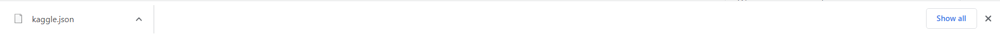
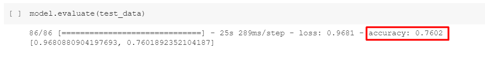
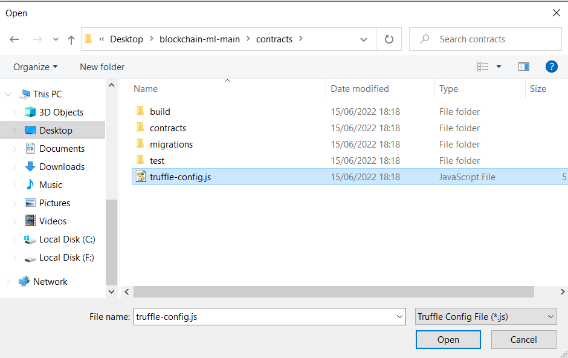
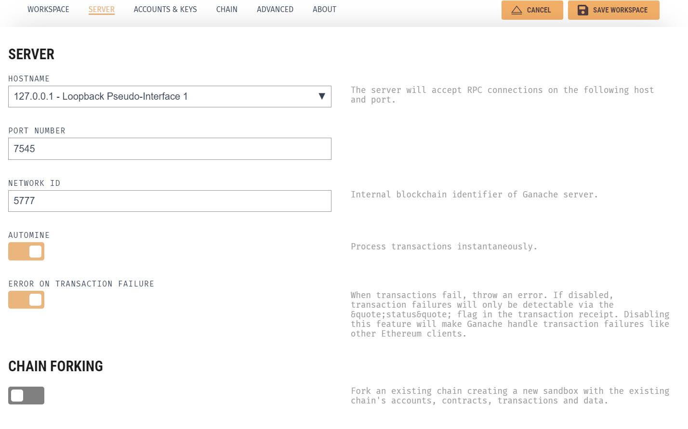
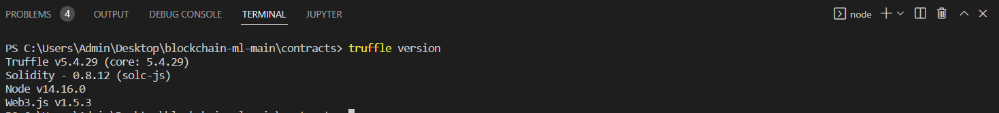
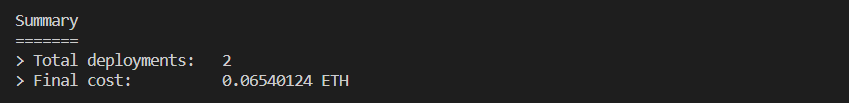
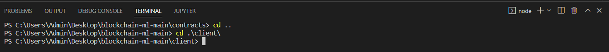
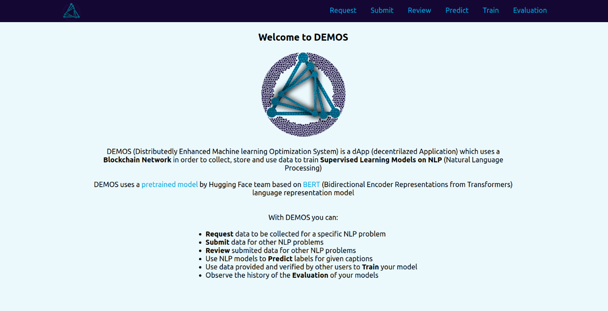
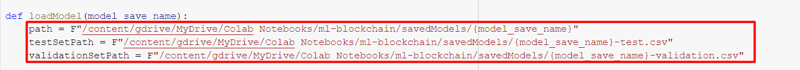

Installation guide for DEMOS dApp

Note: This tutorial was created for Windows 10 however the same
procedures apply for Linux and MacOS Operating Systems. DEMOS dApp was
created using Linux Ubuntu 20.04

Necessary Software you need to install before starting the tutorial:

-   Google Account with Google Drive

-   Python 3 (<https://nodejs.org/en/download/>)

-   Node.js (<https://www.python.org/downloads/>)

-   Truffle (<https://trufflesuite.com/ganache/>)

-   Metamask Extension for Google Chrome
    (<https://chrome.google.com/webstore/detail/metamask/nkbihfbeogaeaoehlefnkodbefgpgknn>)

-   A Kaggle account (this is needed if you want to use a Kaggle
    dataset. If you want to follow this tutorial until the end you need
    to create an account. You can create it using your Google Account)
    (<https://www.kaggle.com/>)

1.  Clone or Download the files from
    https://gitlab.com/netmode/blockchain-ml.git . Main directory folder
    should look like this:

> {width="6.5in"
> height="1.1993055555555556in"}

CHAPTER 1: INITIAL TRAINING

> We start this tutorial with the initial training of the models we will
> use. You don't strictly have to use these datasets or even models,
> after all DEMOS was created to support multiple models and datasets.
> However, we advise you to follow this tutorial as it is before
> experimenting. In this tutorial we will create 3 instances of the same
> model using these datasets:

-   <https://www.kaggle.com/datasets/yasserh/twitter-tweets-sentiment-dataset>

-   [https://www.kaggle.com/datasets/yasserh/imdb-movie-ratings-sentiment-analysis](https://www.kaggle.com/datasets/yasserh/imdb-movie-ratings-sentiment-analysis?select=movie.csv)

-   <https://www.kaggle.com/datasets/ishantjuyal/emotions-in-text>

> We use this model <https://huggingface.co/bert-base-uncased> and the
> training of the Neural Network is based on this
> <https://towardsdatascience.com/sentiment-analysis-in-10-minutes-with-bert-and-hugging-face-294e8a04b671>
> tutorial.

2.  Open Google Drive, create a folder named "ml-blockchain" and upload
    the contents of the GoogleColab-backend folder

{width="4.302083333333333in"
height="1.6445352143482064in"}

3.  Login to Kaggle <https://www.kaggle.com/> and navigate to
    <https://www.kaggle.com/me/account>. Scroll down to find API.

{width="6.5in"
height="2.2625in"}

4.  Click *Expire API Token* to remove previous tokens. Then click
    *Create New API Token* to download kaggle.json file

{width="6.5in"
height="0.23680555555555555in"}

5.  Upload kaggle.json to Google Colab

{width="3.5468755468066493in"
height="1.598746719160105in"}

6.  Double click Twitter-BERT-InitialTrainModel.ipynb to open it in
    Goolge Colab

7.  Scroll to find the first code cell under "Download Kaggle dataset"
    and ensure that the path to kaggle.json file is correct

{width="4.067708880139983in"
height="0.820495406824147in"}

8.  Now it's time to set parameters for training. You are free to change
    these parameters however you like.

Note: There is no perfect universal configuration for all datasets, try
multiple combinations to see what fits your dataset better. Before
changing values check
<https://www.tensorflow.org/api_docs/python/tf/keras/Model#compile>

{width="6.5in"
height="2.2104166666666667in"}

9.  Change runtime type to GPU to accelerate training

{width="1.3524048556430446in"
height="2.0208333333333335in"}

10. Create a new folder called savedModels and ensure that the paths in
    the following cell are pointing to this folder

{width="5.776042213473316in"
height="0.8256780402449694in"}

> It's time to start the initial training! After initial training is
> finished, savedModels folder will contain the model, the validation
> set and the test set

11. Select Runtime and Run all, a window will pop to enable connection
    to Google Drive. Accept it and wait...

12. If you are not satisfied with the accuracy, set new parameters and
    try again

Note: It is important to **save the value of accuracy** for the models
as you will use it later

{width="5.458333333333333in"
height="0.6531342957130358in"}

13. Follow the same procedure for IMDB-BERT-InitialTrainModel.ipynb and
    Emotions-BERT-InitialTrainModel.ipynb

14. When you finish with the initial training for the 3 models the
    savedModels folder should look like this

{width="6.5in"
height="4.665972222222222in"}

CHAPTER 2: GANACHE SETUP

> Pretraining is done! Time to create a local Blockchain

15. Start Ganache. When this window pops up select *NEW WORKSPACE
    ETHEREUM*

{width="6.5in"
height="3.2847222222222223in"}

16. Change WORKSPACE-NAME to a name of your desire and then click *ADD
    PROJECT*

{width="6.5in"
height="2.7729166666666667in"}

17. Select *truffle-config.js* file which is in
    *blockchain-ml-main/contracts* and click *Open*

{width="4.416666666666667in"
height="2.7816502624671915in"}

18. Switch to *SERVER* tab and make sure the following configurations
    are set

{width="6.5in"
height="4.055555555555555in"}

19. Switch to ACCOUNTS & KEYS tab. Here you can change the starting
    balance and the number of accounts to be created. 10 Accounts
    starting with 100 ETH are sufficient for testing the DEMOS dApp,
    however, feel free to add more if you want.

{width="6.5in"
height="3.1368055555555556in"}

Note 1: Remember that **these configurations cannot be changed** after
the Blockchain is created. If you want to add more ETH or more accounts,
you will need to create a new Blockchain

Note 2: Although not clearly stated, we advise you not to change the
default Mnemonic if you don't know what you are doing. This may cause
problems with the connection to Metamask.

20. Let the rest of the configurations to default and click *SAVE
    WORKSPACE* to create the Blockchain. A new Ganache window will
    appear with a list of the newly created accounts

{width="6.5in"
height="3.775in"}

Feel free to look around the options to view information about your
newly created local Blockchain. If you click the CONTRACTS tab you can
view the two Contracts which are not yet deployed and do not have an
address.

{width="6.5in"
height="2.073611111111111in"}

Note: Always **Keep Ganache running** while running DEMOS

CHAPTER 3: FRONTEND SETUP

Local Blockchain is created! Let's deploy the frontend

21. Start Visual Studio Code. Select *File \> Open Folder...* and select
    the main directory folder as shown below. Then click *Select Folder*

{width="2.2239588801399823in"
height="1.6520833333333333in"}

{width="3.7381069553805775in"
height="2.1406255468066493in"}

22. Select *Terminal \> New Terminal* to start a new terminal

> {width="1.30128280839895in"
> height="1.4583333333333333in"}

23. Download npm with command: *npm install -g npm*

24. Update npm with command: *npm install -g npm\@latest*

25. Download Truffle with command: *npm install -g truffle*

Note: It seems like the latest version of Truffle has some glitches
(16/06/2022). You can instead install a previous version using: *npm
install -g <truffle@5.4.29>*

26. Ensure that Truffle was successfully downloaded with command:
    *truffle
    version*{width="6.5in"
    height="0.7395833333333334in"}

27. Install truffle project dependencies with command: *truffle build*
    {width="6.5in"
    height="1.5576388888888888in"}

28. Deploy Contracts with command: truffle migrate --reset

{width="3.696126421697288in"
height="1.484374453193351in"}

{width="3.6958333333333333in"
height="1.966373578302712in"}

{width="3.6666666666666665in"
height="1.9821937882764655in"}

{width="3.6958333333333333in"
height="0.44815944881889763in"}

Note: You can now check Contracts tab in Ganache to see that state has
changed to "DEPLOYED" and contracts have an address

{width="6.5in"
height="1.8993055555555556in"}

29. Perform a basic test on CaptionReview contract's function with
    command: *truffle test*

{width="4.125in"
height="2.7389818460192474in"}

30. Switch to CONTRACTS tab on Ganache, click CaptionReview and copy the
    address

{width="5.220347769028871in"
height="3.0468744531933507in"}

31. Switch to Visual Studio Code and navigate to contract-address.js
    file located in .\\blockchain-ml-main\\client\\constants\\

{width="2.8281255468066493in"
height="2.8798140857392824in"}

32. Replace the old address with the one you copied from Ganache

{width="4.635416666666667in"
height="1.3822058180227472in"}

33. Navigate terminal to contracts folder with command: *cd..* and *cd
    client*

{width="6.5in"
height="0.5701388888888889in"}

34. To install next.js project dependencies (aka create Node modules
    folder) run command: *npm install*

Note: This may take some time

{width="2.151042213473316in"
height="1.7378160542432195in"}

35. To start the frontend run command: *npm run dev*

{width="4.526042213473316in"
height="0.9322878390201225in"}

This will start the frontend on localhost port 3007. If you ctrl + click
on the given URL a browser window will pop up on this URL and you should
be seeing the Login Page of DEMOS.

{width="3.5364588801399823in"
height="1.847950568678915in"}

Note 1: Command *npm run dev* is an alias for *next dev -p 3007.* You
can view and change the aliases in "scripts" located in package.json
file which is in the client folder

Note 2: **Keep frontend running** when you are running DEMOS. You can
terminate the deployment of the frontend by giving ctrl + C command in
the terminal

CHAPTER 4: METAMASK SETUP

Frontend is up and running! Time to connect Metamask so users can login
and interact with DEMOS

36. Switch to Google Chrome were DEMOS Login Page is open, select
    Extensions and then select Metamask

{width="2.4993460192475943in"
height="2.2708333333333335in"}

Note: You can pin Metamask extension to make your life a bit easier as
you will use it regularly through the rest of the tutorial

37. A new window will open welcoming you to Metamask. Select *Get
    Started*{width="3.1354166666666665in"
    height="2.3177285651793524in"}

38. Select Import Wallet

{width="3.9751257655293086in"
height="2.2708333333333335in"}

39. Switch to ACCOUNTS tab in Ganache and copy the MNEMONIC

{width="6.5in"
height="1.457638888888889in"}

40. Paste the Mnemonic, set a password, accept Terms of Use and click
    Import

{width="4.348958880139983in"
height="4.8479735345581805in"}

41. Wallet is now created and you can see Account 1 which has the same
    address as the 1^st^ account in Ganache

{width="6.5in"
height="4.348611111111111in"}

{width="6.5in"
height="1.50625in"}

42. Switch to Google Chrome tab where DEMOS Login Page is and click
    Connect. A Metamask window will pop up. Click *next* and *Connect*
    to connect frontend with Account 1 with Metamask

{width="6.5in"
height="4.4430555555555555in"}

Note: If Metamask window does not show up you may need to refresh or
close and reopen the DEMOS Login Page

You can now see the DEMOS Main Page, but we are not done yet

{width="6.265624453193351in"
height="3.2031244531933507in"}

43. Open Metamask extension

{width="2.7656255468066493in"
height="4.486333114610674in"}

44. Select the Arrow next to Ethereum Mainnet and click Add Network

{width="2.47619094488189in"
height="4.152549212598426in"}

45. Fill the form with a name for the network (we use Localhost 7545).
    RPC URL must be set to <HTTP://127.0.0.1:7545> and Chain ID to 1337.
    You can choose your own Currency Symbol (we used ETH but it is up to
    you). Then click *Save*

{width="5.314815179352581in"
height="3.6079418197725284in"}

46. The new network is successfully added to Metamask and you can see
    the balance of the account has changed and it is now the same as in
    Ganache

{width="6.5in"
height="3.3722222222222222in"}

47. Switch to ACCOUNTS tab in Ganache and click *Show Keys* of the 2^nd^
    account

{width="6.5in"
height="2.560416666666667in"}

48. Copy Private Key

{width="6.5in"
height="2.9756944444444446in"}

49. Switch back to DEMOS page and open Metamask extension again. Click
    the picture next to Localhost 7545 to open the following menu. Then
    select *Import Account*{width="3.04629593175853in"
    height="5.147898075240595in"}

50. Set Private Key as Select Type and paste Private Key. Then click
    *Import*

{width="1.8813976377952757in"
height="3.1666666666666665in"}

51. The 2^nd^ account is successfully added to Metamask

{width="2.9757622484689414in"
height="4.990740376202974in"}

Note: If prompt to connect account to page click Connect

52. Repeat the same procedure to add more accounts to Metamask (we
    advise you to add at least 5 accounts). You can view the list of
    added accounts by clicking the image next to Localhost 7545

{width="3.1289916885389326in"
height="5.185184820647419in"}

53. Connect all added accounts to the page by switching between accounts
    and clicking Not Connected and then Connect. Ensure that all
    accounts are connected

{width="1.767661854768154in"
height="2.925246062992126in"}{width="1.7603182414698162in"
height="2.909034339457568in"}{width="1.7222222222222223in"
height="2.89997375328084in"}

CHAPTER 5: FLASK SERVER SETUP ON GOOGLE COLAB

Blockchain accounts are connected to the frontend! Now it's time to set
up the Flask server.

> If you want to run the Flask server locally continue with Chapter 6
>
> If you want to run the Flask server on Google Colab follow the next
> steps

54. Switch to Google Drive and double click on FlaskServerForBert.ipynb
    to open it on Google Colab

55. Ensure that the paths to savedModels folder are correct

{width="6.5in"
height="0.5763888888888888in"}

{width="6.5in"
height="0.9965277777777778in"}

56. Change runtime type to GPU and run all cells. Once the server is
    running you will see this{width="5.870370734908136in"
    height="1.4243175853018373in"}

57. Copy the Ngrok URL

{width="5.885416666666667in"
height="0.7291666666666666in"}

58. Switch to Visual Studio Code and navigate to
    \\blockchain-ml-main\\client\\constants\\parameters.js. Replace the
    URL on APIpath and save changes

{width="3.4895833333333335in"
height="1.2793230533683289in"}

> Note: **Keep Google Colab running** when using DEMOS. If you are on
> the free tier of Google Colab, use GPU runtime **only when you need
> it** as it is limited.

And that's it! We are all set! You can now use the DEMOS dApp

CHAPTER 6: FLASK SERVER SETUP LOCALLY

> If you want to run Flask server locally make sure that your computer
> has adequate infrastructure to support training. If you don't have a
> powerful GPU or TPU we strongly advise you to run Flask server on
> Google Colab.

59. Download the contents of the savedModels folder and place them in
    \\blockchain-ml-main\\backend\\NeuralNetwork

60. Create a new terminal in Visual Studio Code and navigate it to
    backend folder with command: cd backend

61. Install all necessary Python libraries

-   python -m pip install \--upgrade pip

-   pip install transformers

-   pip install flask

-   pip install -U flask-cors

-   pip install tensorflow

-   pip install pandas

-   pip install sklearn

62. Navigate to \\blockchain-ml-main\\client\\constants\\parameters.js.
    Replace the URL on APIpath with http://127.0.0.1:5000 and save
    changes

{width="3.9270833333333335in"
height="1.6427012248468942in"}

63. Run local Flask server with command: flask run

> Note: You can stop the Flask server with ctrl + C

Congratulations! Everything is set! You can now use the DEMOS dApp

CHAPTER 7: USING DEMOS

> Welcome to DEMOS! First you need to Request data the models. We advise
> you to start with the 3 models created in INITIAL TRAINING before
> using your own models

{width="6.5in"
height="2.5166666666666666in"}

64. Go to the Request page and fill the form as shown below

{width="6.5in"
height="3.467361111111111in"}

Note: You can use any Name or Description you like to describe this
model. We use 3 votes for validation but you can use a different number.
Make sure you add Initial Accuracy of the model as it was in Initial
Training using Google Colab. Finally, give labels without quotes or
spaces in the same order as in Google Colab.

65. Make sure you are using Account 1 in Metamask and click *Request
    Model*. A Metamask window pops up to confirm the transaction, click
    *Confirm*

{width="1.6328116797900263in"
height="3.4375in"}

Note: Once you Confirm you will see a window confirming your transaction

{width="1.9104899387576553in"
height="0.6354166666666666in"}

66. Follow the same procedure to add the other two models

> {width="6.5in"
> height="3.3784722222222223in"}

{width="6.5in"
height="3.3472222222222223in"}

67. Go to Submit page. Here you can see the three models that you
    previously requested. Change to Metamask Account 2. Give a caption
    for a model and choose the most appropriate label. Then Submit
    Caption and confirm transaction.

> {width="6.5in"
> height="2.3493055555555555in"}
>
> Note: An account can request data for a model and then submit such
> data, but it doesn't make much sense. That's why we switch to Account
> 2

68. After submitting a few captions change to Account 3 and go to Review
    page. Review a caption by selecting a label. Then click Review
    Caption and confirm transaction

> {width="6.5in"
> height="1.7652777777777777in"}

Note: if you go to Review page with Account 2 you will see nothing! This
is because the node (user) who submitted a caption cannot review it.
Switch to Account 3 and refresh the page, now you can see the captions
you submitted with Account 2

69. Review the captions using different Metamask accounts until you vote
    the same label 3 times using 3 different accounts

Note 1: A caption is verified when a specific label gets 3 votes from
reviewers. That is because we set Number of Votes for verification to 3.
Then the caption disappears from the Review page (if you refresh).

Note 2: Once a caption is verified, you can see that the balance of the
accounts that vote for the verified label increases. If the verified
caption matches the one that was provided by the node who submitted the
caption, then his balance increases too.

70. Go to Predict page. Here, all the accounts can test the models using
    their own captions. Give it a try!

> {width="6.5in"
> height="2.254166666666667in"}

71. Switch back to Account 1 (who requested the models) and go to Train
    Page. Here you can see all the verified captions that can be used
    for training. Click *Train Model* to retrain the model using these
    captions. When training and evaluation are finished, you will need
    to confirm two transactions

> {width="6.5in"
> height="2.6326388888888888in"}

Note 1: Only the node that requested data for a model can view the
verified data and retrain the model

Note 2: Training and evaluation of the model takes time, you can review
its progress from the Google Colab page

{width="6.5in"
height="0.83125in"}

Note 3: For each caption, if verified label matches proposed label its
container is green, otherwise it's orange.

72. Finally, go to Evaluation page to view the accuracy changes of the
    model

Note: The models are initially trained using tens of thousands of
captions. If you just retrain the model by using a handful of captions
it is expected that accuracy will not be greatly affected. It is also
possible to have a small drop.

{width="6.5in"
height="2.5770833333333334in"}

CHAPTER 8: RESTART DEMOS AFTER THE INITIAL SETUP

1.  Start Ganache and select the Blockchain you created

2.  Start Visual Studio Code. Open a terminal in client directory and
    run command: *npm run dev*

3.  Start DEMOS frontend on browser to get the Login Page

4.  Click Connect, a Metamask window will pop. Login to Metamask using
    the password set in Step 40

Note: You may need to switch to Ethereum Main Network to Login and then
switch back to localhost 7545

5.  Run Flask Server

    a.  If you are running Flask server on Google Colab, run
        FlaskServerForBert.ipynb on Google Colab using GPU. You need to
        replace the APIpath with the new Ngrok URL as you did in steps
        57-58 as it changes every time.

    b.  If you are running Flask server locally, create a new terminal
        in backend folder and run command: *run flask*
