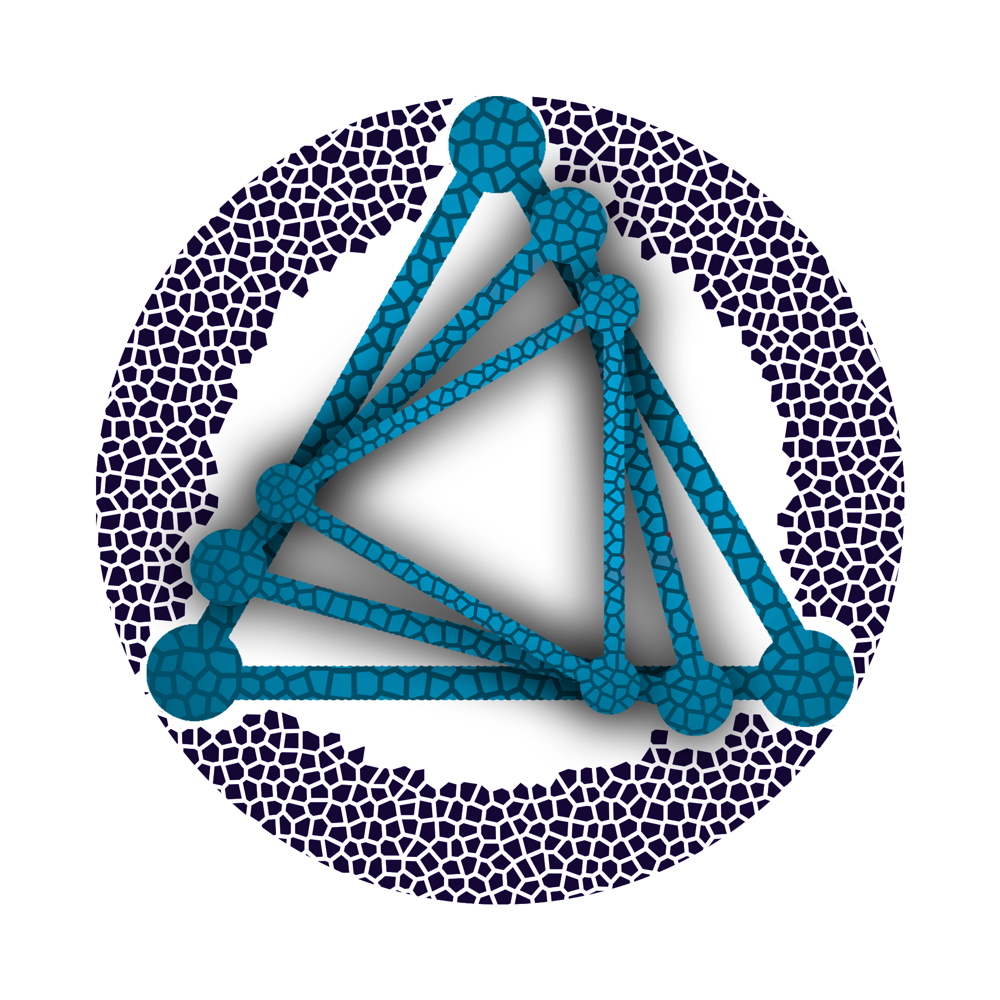

# DEMOS (Distributedly Enhanced Machine learning Optimization System) dApp

## Description
DEMOS (Distributedly Enhanced Machine learning Optimization System) is a dApp (decentrilazed Application) which uses a Blockchain Network in order to collect, store and use data to train Supervised Learning Models on NLP (Natural Language Processing). DEMOS was created within a diploma thesis in NETwork Management & Optimal DEsign Laboratory, School of Electrical & Computer Engineering of the National Technical University of Athens (NTUA).

## Requirements
Solidity >=0.4.22 <0.9.0 
Truffle v5.4.29 
Ganache 2.5.4.0 
Metamask 10.15.1 
Node.js v14.16.0 
Next.js 12.1.5 
React.js 18.0.0 
Python 3.10.0 
Flask 2.1.2 

## Installation
There is a complete Installation Guide in the repo's wiki https://gitlab.com/netmode/blockchain-ml/-/wikis/Installation-Guide

## Authors
Demetris Kyriacou (@demKyr) 

## Acknowledgment
Eleni Fotopoulou (@elfo) 
Anastasios Zafeiropoulos (@tzafeir)

## License
GNU Affero General Public License v3.0
